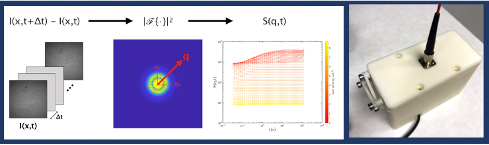

# Bibiography

Dr Ungkarn was appointed as a researcher at National Electronics and Computer Technolofy Center (Thailand). Dr Ungkarn took a BEng in Computer Engineering at Thammasart University, Thailand. Then, He continued to undertake MEng at Chulalongkorn University, Thailand. In 2021, Dr Ungkarn grauated PhD in Biomedical Engineering from James Watt School of Engineering, University of Glasgow, UK. His PhD developed an sceintific instrument to reveal microrheological behaviours of biological fluids under supervision of Professor Jon Copper and Dr Julien Reboud by collaboration with Dr Manlio Tassieri.


# Research Interests
My research interests are in the use of light scattering techniques to investigate microrhological responses of fluids and to retreive size distribution of colloidal micro-nanoparticles. Study of microrheology benefits for manufacturing and lifesciences research producing precisely defined materials of interest. Whereas, micro-nano particle sizing to create a tools aiming at detection of protein aggregation and antigen-antiboy interactions. Application spans from biological researches to clinical practices.


## Research
### A portable microrheology device
We created a tool for characterising microrheological responses for biological fluids such as Human whole blood, Human blood plasma, Bovine serum albumin, Human saliva and so on.


### Particle sizing
We developed an alorithm to recover micro-nano particle size distribution of colloidal particles.


## Collaborations


```markdown
**A portable microrheology device**


- Bulleted
- List


1. Numbered
2. List

# **Bold** and _Italic_ and `Code` text

[Link](url) and 
```

For more details see [Basic writing and formatting syntax](https://docs.github.com/en/github/writing-on-github/getting-started-with-writing-and-formatting-on-github/basic-writing-and-formatting-syntax).


