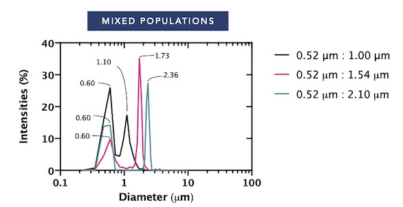

# Bibiography

Dr Ungkarn was appointed as a researcher at National Electronics and Computer Technology Center, Thailand. Dr Ungkarn took a BEng in Computer Engineering at Thammasat University, Thailand. Then, He continued to undertake MEng at Chulalongkorn University, Thailand. In 2021, Dr Ungkarn graduated PhD in Biomedical Engineering from James Watt School of Engineering, University of Glasgow, UK. His PhD developed a sceintific instrument to reveal microrheological behaviours of biological fluids under supervision of Professor Jon Cooper and Dr Julien Reboud, and in collaboration with Dr Manlio Tassieri.

# Research Interests
My research interests are in the use of light scattering techniques to investigate microrheological responses of fluids and to retreive size distribution of colloidal micro-nanoparticles. Study of microrheology benefits for manufacturing and life sciences research producing precisely defined materials of interest. Whereas, micro-nano particle sizing to create a tools aiming at detection of protein aggregation and antigen-antiboy interactions. Application spans from biological researches to clinical practices.

# Contact
email: ungkarn.jarujareet@nectec.or.th

# Research
## A portable microrheology device

We created a tool for characterising microrheological responses for biological fluids such as Human whole blood, Human blood plasma, Bovine serum albumin, Human saliva and so on.

## Particle sizing

We developed an alorithm to recover micro-nano particle size distribution of colloidal particles from their motions.

# Collaborations
### Department of Statistics, Faculty of Science, Khonkaen university, Thailand.
### Faculty of Dentistry, Thammasat university, Thailand.
### Faculty of Medicine, Chaing Mai university, Thailand.

