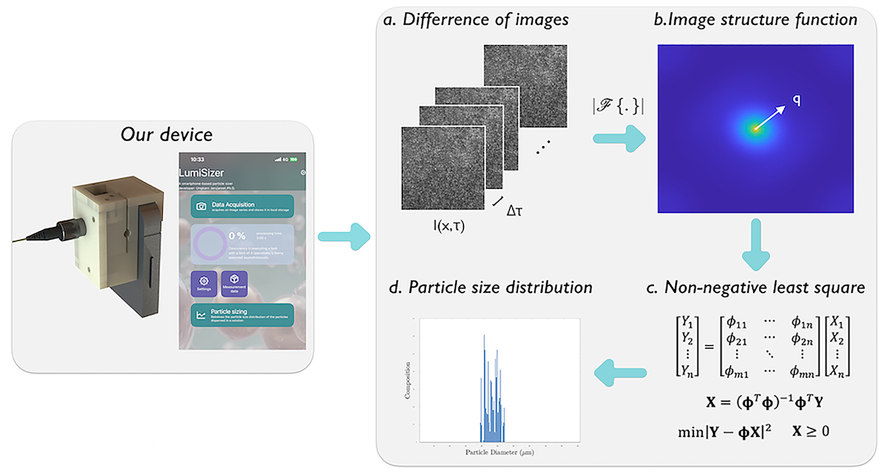
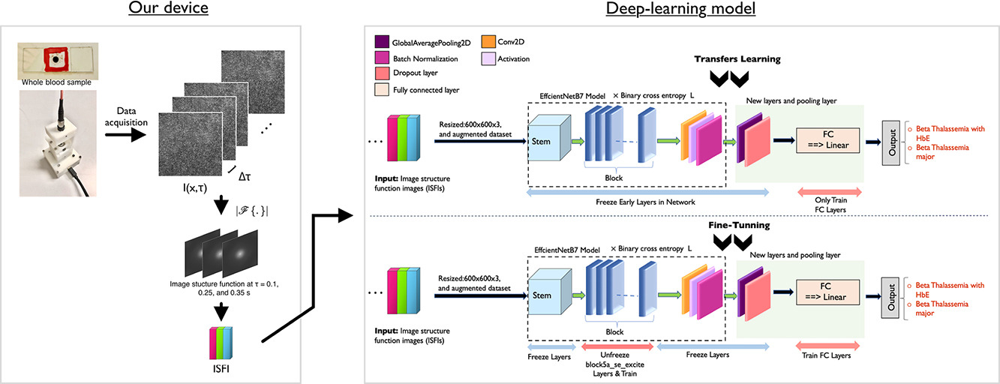

[Home](./) | [Research](./research.html) | [Collaborations](./collaboration.html)

# Research

## Smartphone-based platform for micro and nanoparicles sizing
  
Micro- and nanoparticle sizing plays a vital role in fields such as diagnostics, water treatment, and micro/nanomaterial synthesis, yet conventional differential dynamic microscopy (DDM) systems remain bulky, non-portable, and unable to resolve multi-modal size distributions. To overcome these limitations, we developed a compact, low-cost smartphone-based DDM platform using a reversed lens and 3D-printed housing to create a portable microscope capable of non-destructive, label-free particle sizing. By capturing Brownian motion of dispersed particles and analyzing image sequences with a differential dynamic algorithm coupled to non-negative least squares, the system determines accurate size distributions within four minutes using six concurrent processing streams. Our prototype successfully measured gold nanoparticles as small as 30 nm from only a 10 µL sample, demonstrating strong potential for accessible nanoparticle diagnostics and micro/nanomaterial synthesis workflows.

*U. Jarujareet, & P. Koonyosying (2025). A smartphone platform for portable and cost-effective micro- and nanoparticle sizing. Sensors and Actuators A: Physical, 117372. <a href="https://doi.org/10.1016/j.sna.2025.117372"> https://doi.org/10.1016/j.sna.2025.117372 </a>.*

---
## Beta-Thalassemia variant classification
  
We proposed an image structure image (ISFI) of a whole blood, a novel feature for thalassemia variant classification using deep-learning approach.

*U. Jarujareet,K. Wiratchawa, T. Petiwathayakorn, P. Koonyosying, S. Hantrakool, S. Srichairatanakool, and T. Intharah (2025). Classification of beta-thalassemia major and HbE/beta-thalassemia via deep learning of image structure function image. In Biomedical Signal Processing and Control (Vol. 102, p. 107265). Elsevier BV. doi : <a href="https://doi.org/10.1016/j.bspc.2024.107265"> https://doi.org/10.1016/j.bspc.2024.107265 </a>.*

---
## A portable device for microrheological characterisation
  
We created a tool for characterising microrheological responses(e.g. loss and storage modulus, complex and shear viscosity) for biological fluids such as Human whole blood, Human blood plasma, Bovine serum albumin, Human saliva and so on.

*S. Srisomboon, T. Intharah, U. Jarujareet, A. Toneluck, & P. Panpisut. The in vitro assessment of rheological properties and dentin remineralization of saliva substitutes containing propolis and aloe vera extracts (T. Chaubal, Ed.). Public Library of Science (PLoS), 2024. doi : <a href="https://doi.org/10.1371/journal.pone.0304156"> 10.1371/journal.pone.0304156 </a>.*

*T. Petiwathayakorn, N. Paradee, S. Hantrakool, U. Jarujareet, T. Intharah, S. Srichairatanakool, & P. Koonyosying. A Compact Differential Dynamic Microscopy-based Device (cDDM): An Approach Tool for Early Detection of Hypercoagulable State in Transfusion-Dependent-β-Thalassemia Patients. In ACS Applied Bio Materials. American Chemical Society (ACS), 2024. doi : <a href="https://doi.org/10.1021/acsabm.4c00516"> 10.1021/acsabm.4c00516 </a>.*

---
## DeepDDM
  
We proposed a compact deep-learning assisted platform for micro-rheological assessment of micro-volume fluids for investigating artificial saliva rheological properties and thier relationship to dentin remineralization.

*U. Jarujareet, K. Wiratchawa, P. Panpisut and T. Intharah, "DeepDDM: A Compact Deep-Learning Assisted Platform for Micro-Rheological Assessment of Micro-Volume Fluids," in IEEE Access, vol. 11, pp. 66467-66477, 2023, doi: <a href="https://doi.org/10.1109/ACCESS.2023.3290496"> 10.1109/ACCESS.2023.3290496 </a>.*

---
## Smartphone spectrometer
  
Investigation of the optical properties of a material, which is based on how the material absorbs, transmits, and reflects light, can be used to study biochemical analytes. The optical spectroscopy is a common scientific instrument for quantifying the light absorbance of analytes. It broke up collected light into various light spectrum components and monitored light intensity as a function of wavelength. 
Advancement in smartphone technology has led to the development of portable, low-cost smartphone-based spectrometers. These devices can be used in various applications, such as food and beverage analysis, medical diagnostics, and environmental monitoring.

*Jarujareet U., Pichayawaytin G., Sripetch P., Doljirapisit N., Sumriddetchkajorn S., Prempree P., Chaitavon K., Punpetch P., and Amarit R., “A Low-Cost Dual-Beam Smartphone Visible Spectrometer”, Journal of Chemical Education, 2023, 100 (2), 546-553, doi: <a href="https://doi.org/10.1021/acs.jchemed.2c00642"> 10.1021/acs.jchemed.2c00642 </a>.*

