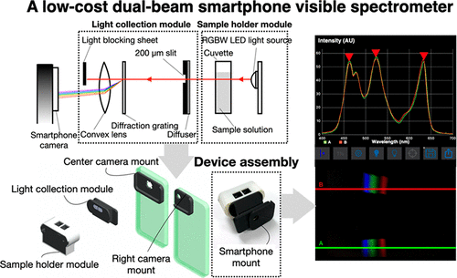

# Research
## A portable device for microrheological characterisation
  
We created a tool for characterising microrheological responses(e.g. loss and storage modulus, complex and shear viscosity) for biological fluids such as Human whole blood, Human blood plasma, Bovine serum albumin, Human saliva and so on.

*S. Srisomboon, T. Intharah, U. Jarujareet, A. Toneluck, & P. Panpisut. The in vitro assessment of rheological properties and dentin remineralization of saliva substitutes containing propolis and aloe vera extracts (T. Chaubal, Ed.). Public Library of Science (PLoS), 2024. doi : <a href="https://doi.org/10.1371/journal.pone.0304156"> 10.1371/journal.pone.0304156 </a>.*

*T. Petiwathayakorn, N. Paradee, S. Hantrakool, U. Jarujareet, T. Intharah, S. Srichairatanakool, & P. Koonyosying. A Compact Differential Dynamic Microscopy-based Device (cDDM): An Approach Tool for Early Detection of Hypercoagulable State in Transfusion-Dependent-β-Thalassemia Patients. In ACS Applied Bio Materials. American Chemical Society (ACS), 2024. doi : <a href="https://doi.org/10.1021/acsabm.4c00516"> 10.1021/acsabm.4c00516 </a>.*

---
## DeepDDM
  
We proposed a compact deep-learning assisted platform for micro-rheological assessment of micro-volume fluids for investigating artificial saliva rheological properties and thier relationship to dentin remineralization.

*U. Jarujareet, K. Wiratchawa, P. Panpisut and T. Intharah, "DeepDDM: A Compact Deep-Learning Assisted Platform for Micro-Rheological Assessment of Micro-Volume Fluids," in IEEE Access, vol. 11, pp. 66467-66477, 2023, doi: <a href="https://doi.org/10.1109/ACCESS.2023.3290496"> 10.1109/ACCESS.2023.3290496 </a>.*

---
## Particle sizing
  
We developed an alorithm to recover micro-nano particle size distribution of colloidal particles from their motions.

---
## Smartphone spectrometer
  
Investigation of the optical properties of a material, which is based on how the material absorbs, transmits, and reflects light, can be used to study biochemical analytes. The optical spectroscopy is a common scientific instrument for quantifying the light absorbance of analytes. It broke up collected light into various light spectrum components and monitored light intensity as a function of wavelength. 
Advancement in smartphone technology has led to the development of portable, low-cost smartphone-based spectrometers. These devices can be used in various applications, such as food and beverage analysis, medical diagnostics, and environmental monitoring.

*Jarujareet U., Pichayawaytin G., Sripetch P., Doljirapisit N., Sumriddetchkajorn S., Prempree P., Chaitavon K., Punpetch P., and Amarit R., “A Low-Cost Dual-Beam Smartphone Visible Spectrometer”, Journal of Chemical Education, 2023, 100 (2), 546-553, doi: <a href="https://doi.org/10.1021/acs.jchemed.2c00642"> 10.1021/acs.jchemed.2c00642 </a>.*

[back](./)
